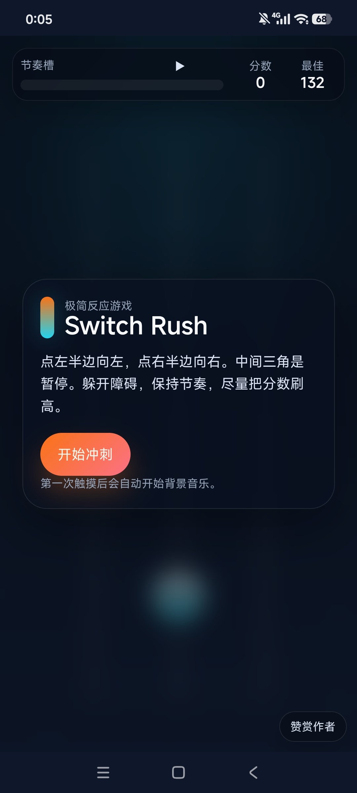
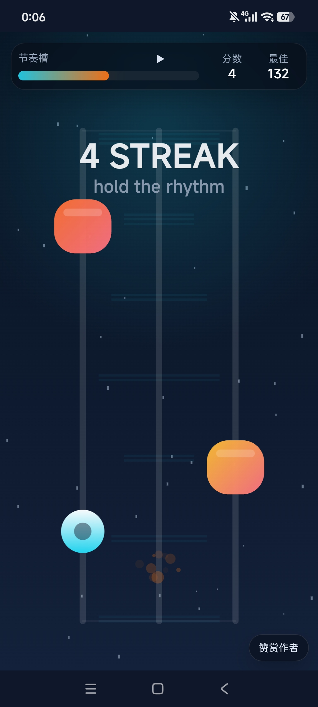

# Switch Rush

[English README](./README.md)

`Switch Rush` 是一个极简的三轨闪避小游戏，主打移动端单指操作、节奏反馈和可安装体验。

## 游戏截图

### 首页



### 游戏中



## 版权说明

本仓库代码仅用于作品展示与学习参考。

未经作者许可，不得分发、商用或用于二次发布。

## 项目结构

- 根目录网页版本：可直接本地运行，也可部署为静态站点 / PWA
- `android-app/`：Android WebView 壳工程，用来打包成可安装的安卓应用

## 功能亮点

- 三轨闪避玩法，单指即可完成操作
- `FLOW / FEVER` 节奏反馈系统
- 内置轻量合成器背景音乐与音效
- 支持暂停、最佳分数记录、赞赏页入口
- 支持 PWA 安装
- 支持 Android WebView 封装

## 文档说明

- `README.md`：英文项目介绍
- `README_CN.md`：中文项目介绍
- `CHANGELOG.md`：从初始版本到当前版本的迭代记录
- `RELEASE_CHECKLIST.md`：提交 GitHub 和打正式 APK 前的检查清单

## 本地运行

```powershell
cd D:\coding\codex
python -m http.server 4173
```

然后打开：

```text
http://localhost:4173
```

## Android 打包

直接用 Android Studio 打开：

`D:\coding\codex\android-app`
